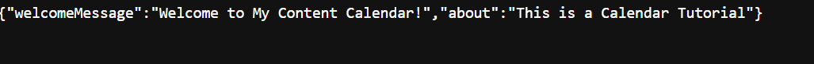

# Content Calendar

 Beginner Spring Boot Project based on Dan Vega Youtube tutorial.
    ->https://youtu.be/UgX5lgv4uVM?si=E9M8iXKnMcBGqE9u

##Version 1.0.0
Current version of application returns HTTP requests in json format. (i.e)

To see all HTTP requests go to content.http file in the root directory.

Concepts learned:
    - Spring Core
    - Spring MVC
    - Spring Data 
    - MySQL

To run application in terminal:
    - mvn clean install
    - mvn spring-boot:run